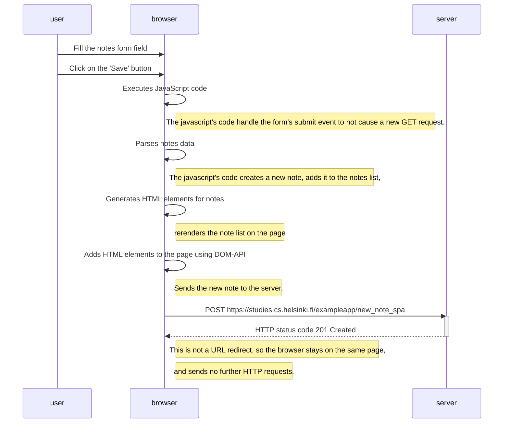

```mermaid
sequenceDiagram
    participant user
    participant browser
    participant server


    user->>browser: Fill the notes form field
    user->>browser: Click on the 'Save' button
    
    browser->>browser: Executes JavaScript code
        Note right of browser: The javascript's code handle the form's submit event to not cause a new GET request.
    browser->>browser: Parses notes data
        Note right of browser: The javascript's code creates a new note, adds it to the notes list, 
    browser->>browser: Generates HTML elements for notes
        Note right of browser: rerenders the note list on the page
    browser->>browser: Adds HTML elements to the page using DOM-API
        Note right of browser:  Sends the new note to the server.

    browser->>server: POST https://studies.cs.helsinki.fi/exampleapp/new_note_spa
    activate server
    server-->>browser: HTTP status code 201 Created
    deactivate server

    Note right of browser: This is not a URL redirect, so the browser stays on the same page,
    Note right of browser:  and sends no further HTTP requests.


    
```